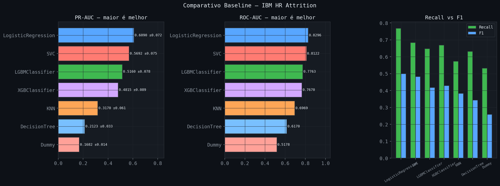
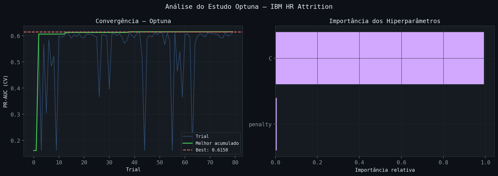
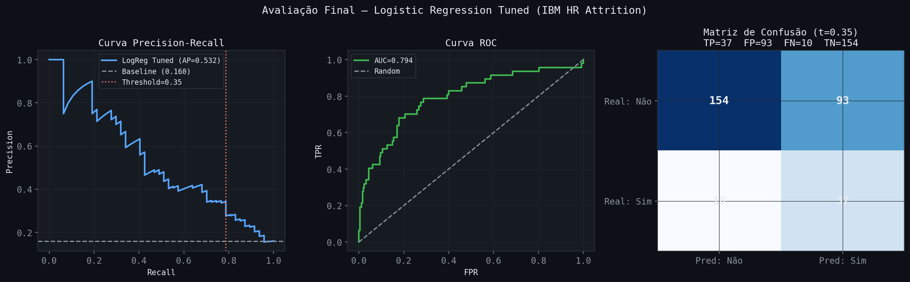
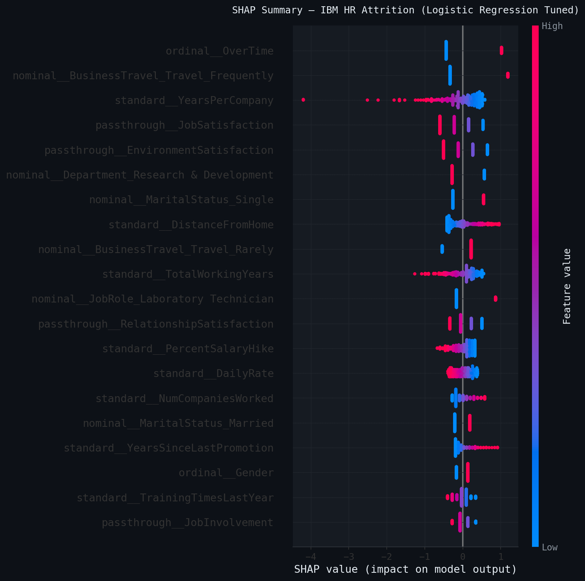
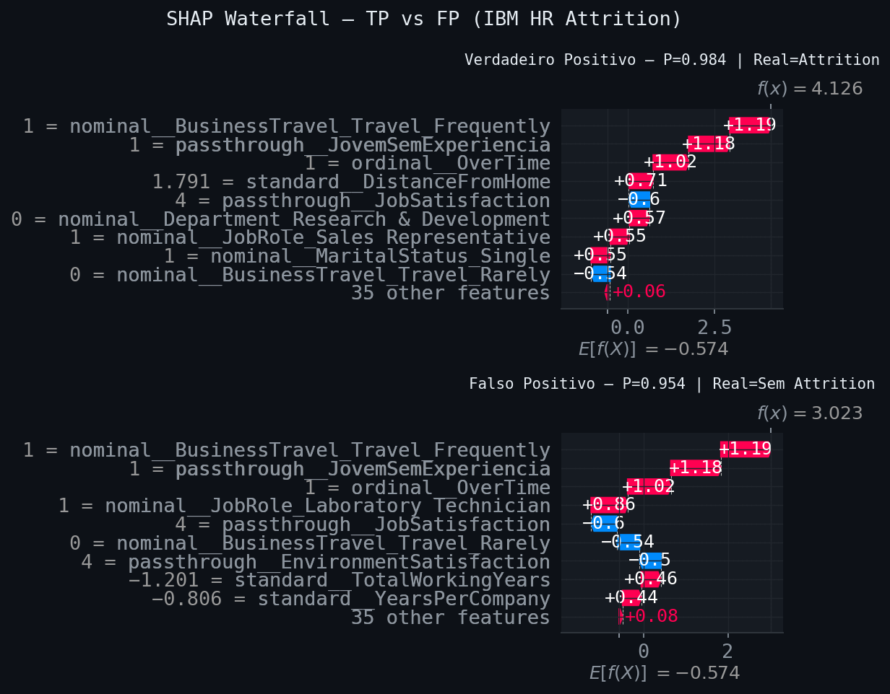
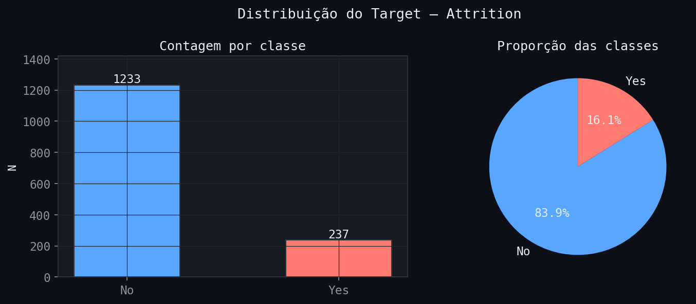

# 👥 IBM HR Attrition — Employee Turnover Predictor

[](https://python.org)
[](https://scikit-learn.org)
[](https://streamlit.io)
[](https://imbalanced-learn.org)
[](https://shap.readthedocs.io)
[](https://optuna.org)
[](LICENSE)

> Pipeline completa de Machine Learning para previsão de turnover voluntário
> em dados de RH da IBM — com **ImbPipeline + RandomUnderSampler**,
> dois ColumnTransformers especializados e interpretabilidade via SHAP.

🔗 **[Acessar App no Streamlit Cloud](https://ibm-attrition-mzpihkegk29fxsnoa7w6hn.streamlit.app/)**

---

## 📋 Sumário

- [Contexto](#contexto)
- [Resultados](#resultados)
- [Visualizações](#visualizações)
- [Pipeline](#pipeline)
- [Estrutura do Repositório](#estrutura-do-repositório)
- [Como Executar](#como-executar)
- [Principais Insights](#principais-insights)
- [Tecnologias](#tecnologias)
- [Autor](#autor)

---

## Contexto

O dataset IBM HR Analytics contém informações de **1.470 funcionários**
com 35 features de RH. O objetivo é prever quais funcionários têm maior
risco de saída voluntária — permitindo ações preventivas de retenção.

| Dado | Valor |
|---|---|
| Fonte | IBM HR Analytics (Kaggle) |
| Registros | 1.470 funcionários |
| Taxa de Attrition | 16.1% (237 saídas) |
| Desbalanceamento | 5.2:1 |
| Features originais | 35 |
| Features após eng. | 30 input → 44 após encoding |

---

## Resultados

### Comparativo de Modelos — 5-fold StratifiedKFold + RUS

| Modelo | PR-AUC | ROC-AUC | Recall |
|---|---|---|---|
| **LogisticRegression** | **0.609** | **0.830** | **0.768** |
| SVC | 0.569 | 0.812 | 0.684 |
| LGBMClassifier | 0.516 | 0.776 | 0.647 |
| XGBClassifier | 0.482 | 0.767 | 0.668 |
| KNN | 0.317 | 0.697 | 0.574 |
| DecisionTree | 0.212 | 0.617 | 0.632 |
| Dummy | 0.168 | 0.518 | 0.532 |

### Modelo Final — LogisticRegression Tuned (ElasticNet)

| Métrica | Valor |
|---|---|
| PR-AUC (teste) | 0.532 |
| ROC-AUC (teste) | 0.794 |
| Recall | 0.787 |
| Threshold | 0.35 |
| TP | 37 |
| FP | 93 |
| FN | 10 |
| TN | 154 |

> **Por que Recall > Precision?** Em RH, o custo de perder um
> funcionário qualificado (FN) é muito maior que o custo de uma
> conversa de retenção desnecessária (FP). Threshold=0.35 prioriza
> não deixar passar casos reais.

### Diferenciais da Refatoração

| Componente | Antes | Depois |
|---|---|---|
| Encoding | `LabelEncoder` + `pd.get_dummies` | `OrdinalEncoder` + `OHE` no `ColumnTransformer` |
| Balanceamento | Externo ao CV | `RUS` dentro do `ImbPipeline` |
| Preprocessadores | 1 genérico | **2 especializados** (linear vs tree-based) |
| Artefatos | 3 pkl separados | **1 `pipeline_final.joblib`** |
| Inferência | encoder → scaler → modelo | `pipeline.predict_proba(X_raw)` |

---

## Visualizações

### Comparativo de Modelos Baseline
> LogisticRegression lidera em PR-AUC com ImbPipeline + RUS



---

### Análise Optuna — Convergência + Importância dos HPs
> 80 trials · ElasticNet com l1_ratio≈0.95 · convergiu no trial 38



---

### Avaliação Final — Curvas PR + ROC + Matriz de Confusão
> PR-AUC=0.532 · ROC-AUC=0.794 · Recall=0.787 · Threshold=0.35



---

### SHAP Summary — Top Preditores
> OverTime lidera (0.588) — consistente com análise original



---

### SHAP Waterfall — Verdadeiro Positivo vs Falso Positivo
> P=0.984 (TP) vs P=0.954 (FP) — fatores que influenciam cada predição



---

### Distribuição do Target + EDA
> Análise exploratória — OverTime e BusinessTravel como principais preditores



---

## Pipeline

```
NB01 → NB02 → NB03 → NB04 → NB05 → NB06
 EDA   Feat.  Base   Tuning  SHAP   Rel.
       Eng.   line
```

| Notebook | Descrição | Entregável |
|---|---|---|
| `01_eda.ipynb` | EDA com testes estatísticos + análise de OverTime | 5 figuras |
| `02_feature_engineering.ipynb` | **2 ColumnTransformers** (linear + tree) + 5 features derivadas | Splits + artefatos |
| `03_modelagem_baseline.ipynb` | **ImbPipeline + RUS** · 7 modelos · StratifiedKFold | Comparativo |
| `04_tuning.ipynb` | Optuna 80 trials · ElasticNet · saga solver | `pipeline_final.joblib` |
| `05_interpretabilidade.ipynb` | SHAP LinearExplainer · Waterfall · Dependence plots | 4 figuras |
| `06_relatorio_final.ipynb` | Consolidação + recomendações de RH | HTML GitHub Dark |

---

## Estrutura do Repositório

```
ibm_attrition/
├── app/
│   ├── main.py
│   ├── utils.py                    # carregar_pipeline() — objeto único
│   └── pages/
│       ├── 1_EDA.py
│       ├── 2_Modelagem.py
│       ├── 3_SHAP.py
│       └── 4_Inferencia.py         # pipeline.predict_proba(X_raw)
├── configs/
│   └── config.yaml
├── data/
│   ├── raw/                        # employee_attrition.csv
│   └── processed/                  # parquets
├── models/
│   ├── pipeline_final.joblib       # ImbPipeline completo
│   ├── pipeline_linear.pkl         # ColumnTransformer (com scaler)
│   └── pipeline_arvore.pkl         # ColumnTransformer (sem scaler)
├── notebooks/                      # 6 notebooks
├── reports/
│   ├── figures/                    # 15 figuras
│   ├── comparativo_modelos.csv
│   └── relatorio_final.html
├── src/
│   ├── config.py
│   ├── viz_config.py               # GitHub Dark Theme
│   └── __init__.py
├── requirements.txt
└── environment.yml
```

---

## Como Executar

### 1. Clonar o repositório

```bash
git clone https://github.com/jhastoledo/ibm-attrition.git
cd ibm-attrition
```

### 2. Criar o ambiente

```bash
conda env create -f environment.yml
conda activate singularity
pip install -e .
```

### 3. Obter o dataset

Baixar `employee_attrition.csv` do
[Kaggle — IBM HR Analytics](https://www.kaggle.com/datasets/pavansubhasht/ibm-hr-analytics-attrition-dataset)
e colocar em `data/raw/`.

### 4. Rodar os notebooks

```bash
jupyter lab
```

### 5. Rodar o app

```bash
streamlit run app/main.py
```

---

## Principais Insights

### OverTime é o preditor #1 (SHAP=0.588)
Funcionários que fazem hora extra têm risco de attrition
dramaticamente maior. Política de horas extras é a alavanca
de retenção mais impactante segundo o modelo.

### ImbPipeline garante CV sem data leakage
O `RandomUnderSampler` aplicado **dentro** de cada fold do
cross-validation evita que a distribuição manipulada vaze
para os dados de validação — erro comum em projetos anteriores.

### Dois ColumnTransformers especializados
Modelos lineares precisam de `StandardScaler` para convergir.
Modelos tree-based não precisam de scaling — e podem performar
melhor sem ele. A separação dos preprocessadores reflete
essa diferença arquitetural.

### LogisticRegression superou LGBM e XGBoost
Com o preprocessamento correto (StandardScaler + OHE + OrdinalEncoder)
e balanceamento via RUS, a Regressão Logística obteve PR-AUC=0.609
vs LGBM=0.516 e XGB=0.482 no cross-validation.

### Top 7 Preditores SHAP

| # | Feature | SHAP | Ação |
|---|---|---|---|
| 1 | OverTime | 0.588 | Limitar horas extras |
| 2 | BusinessTravel_Frequently | 0.486 | Reduzir viagens |
| 3 | YearsPerCompany | 0.387 | Monitorar histórico instável |
| 4 | JobSatisfaction | 0.380 | Pesquisas de clima |
| 5 | EnvironmentSatisfaction | 0.378 | Melhorar ambiente físico |
| 6 | MaritalStatus_Single | 0.356 | Programas de integração |
| 7 | DistanceFromHome | 0.317 | Home office / transporte |

---

## Tecnologias

**Linguagem**


**Dados e Análise**


**Machine Learning**


**Visualização e App**


**Ambiente**


---

## Autor

<div align="center">

### Jhonnes Toledo

**Físico (BSc & MSc — UFJF) | Pós-graduando em Data Science (UNINASSAU)**

Data Science practitioner com background em física, estatística e
machine learning. Experiência em Python, análise exploratória,
modelagem preditiva e deploy de aplicações.

<br>

[](https://www.linkedin.com/in/jhonnestoledo/)
[](https://github.com/jhastoledo)
[](mailto:jas_toledo@hotmail.com)

</div>

---

<div align="center">
  <i>1.470 funcionários · Recall=79% · ImbPipeline + RUS ·
  OverTime preditor #1 · Logistic Reg. > LGBM + XGBoost</i>
</div>
